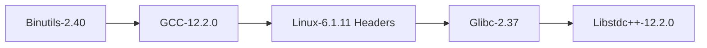

#  Linux From Scratch (LFS): A Beginner's Guide  
**For Low-Level Developers and Systems Architects**  

This guide provides a strategic roadmap for learning Linux From Scratch (LFS) based on the official documentation at [linuxfromscratch.org](https://www.linuxfromscratch.org). As a 30-year veteran in kernel and systems programming, I'll help you navigate this complex journey with professional insights.

## Why Learn LFS?  
- Understand Linux internals at a fundamental level  
- Gain unparalleled control over your system components  
- Develop deep debugging and optimization skills  
- Build a foundation for kernel development and embedded systems  

## Phase 1: Preparation (2-3 Days)  

### 1.1 Prerequisite Knowledge  
```bash  
# Essential skills to verify before starting:  
1. C programming (Pointers, memory management)  
2. Makefile comprehension  
3. POSIX shell scripting  
4. Basic understanding of:  
   - ELF binaries  
   - Kernel boot process  
   - Toolchain components (gcc, binutils, glibc)  
```

### 1.2 Host System Setup  
**Minimum Requirements**:  
- 64-bit x86_64 system  
- 20GB free disk space (SSD recommended)  
- Reliable internet connection  
- Current Linux distribution (Fedora/Ubuntu/Arch)  

**Host Package Installation**:  
```bash  
# For Ubuntu-based systems:  
sudo apt install build-essential bison gawk texinfo git

# For Arch-based systems:  
sudo pacman -S base-devel bison flex texinfo git  
```

### 1.3 Resource Allocation  
```bash  
# Create optimal build environment:  
mkdir -p $HOME/lfs  
chattr +C $HOME/lfs  # Disable copy-on-write for ext4  
export LFS=$HOME/lfs  
```

## Phase 2: Toolchain Construction (3-5 Days)  

### 2.1 Critical Path Packages  


### 2.2 Cross-Compilation Setup  
```bash  
export LFS_TGT=$(uname -m)-lfs-linux-gnu  
export PATH=$LFS/tools/bin:$PATH  

# Build commands must use:  
../configure --prefix=$LFS/tools \  
             --with-sysroot=$LFS \  
             --target=$LFS_TGT \  
             --disable-nls \  
             --enable-default-pie \  
             --enable-default-ssp  
```

### 2.3 Professional Tips  
1. **Parallel Builds**: Use `make -j$(nproc)` but monitor memory  
2. **Build Logging**:  
   ```bash  
   { time make; } 2>&1 | tee build.log  
   ```  
3. **Sanity Checks**:  
   ```bash  
   echo 'int main(){}' > dummy.c  
   $LFS_TGT-gcc dummy.c  
   readelf -l a.out | grep '/ld-linux'  # Verify loader path  
   ```

## Phase 3: Building the Temporary System (5-7 Days)  

### 3.1 Key Package Building Order  
```  
1. M4-1.4.19  
2. Ncurses-6.4  
3. Bash-5.2.15  
4. Coreutils-9.1  
5. Diffutils-3.9  
6. File-5.44  
7. Findutils-4.9.0  
8. Gawk-5.2.1  
9. Grep-3.8  
10. Gzip-1.12  
11. Make-4.4  
12. Patch-2.7.6  
13. Sed-4.9  
14. Tar-1.34  
15. Xz-5.4.1  
```

### 3.2 Chroot Environment Setup  
```bash  
sudo mkdir -pv $LFS/{dev,proc,sys,run}  
sudo mount -v --bind /dev $LFS/dev  
sudo mount -vt devpts devpts $LFS/dev/pts -o gid=5,mode=620  
sudo mount -vt proc proc $LFS/proc  
sudo mount -vt sysfs sysfs $LFS/sys  
sudo mount -vt tmpfs tmpfs $LFS/run  

sudo chroot "$LFS" /usr/bin/env -i \  
    HOME=/root \  
    TERM="$TERM" \  
    PS1='(LFS chroot) \u:\w\$ ' \  
    PATH=/usr/bin:/usr/sbin \  
    /bin/bash --login  
```

## Phase 4: Building the Full System (7-10 Days)  

### 4.1 Critical Components  
| Package | Version | Build Time | Special Flags |  
|---------|---------|------------|---------------|  
| Linux Kernel | 6.1.11 | 60-90 min | `make defconfig` |  
| Glibc | 2.37 | 45 min | `--enable-kernel=4.19` |  
| GCC | 12.2.0 | 3-5 hrs | `--enable-languages=c,c++` |  
| Systemd | 253 | 90 min | `-Dsplit-usr=true` |  

### 4.2 Bootloader Configuration (GRUB)  
```bash  
grub-install /dev/sdX  # Replace with target disk  
cat > /boot/grub/grub.cfg << "EOF"  
set timeout=5  
set default=0  

menuentry "Linux From Scratch" {  
    linux /boot/vmlinuz-6.1.11-lfs root=/dev/sdX ro  
}  
EOF  
```

## Phase 5: System Configuration (2 Days)  

### 5.1 Essential Files  
```bash  
# /etc/fstab  
/dev/sdX1    /          ext4   defaults   1 1  
proc         /proc      proc   defaults   0 0  
sysfs        /sys       sysfs  defaults   0 0  

# /etc/hosts  
127.0.0.1  localhost  
::1        localhost  

# /etc/passwd (minimal)  
root:x:0:0:root:/root:/bin/bash  
```

### 5.2 Kernel Tuning  
```bash  
# /etc/sysctl.d/10-optimize.conf  
kernel.panic=10  
vm.swappiness=10  
net.ipv4.tcp_fastopen=3  
fs.file-max=2097152  
```

## Debugging Strategies  

### Common Failure Points  
1. **Toolchain Breakage**:  
   ```bash  
   ldd /bin/bash  # Verify library dependencies  
   strace -f gcc hello.c  # Trace system calls  
   ```  

2. **Boot Failures**:  
   ```bash  
   dmesg | grep -i 'error\|fail'  
   journalctl -b -p3  # Show critical logs  
   ```  

3. **Package Build Failures**:  
   ```bash  
   make V=1  # Verbose build output  
   objdump -d config.log  # Inspect generated code  
   ```

## Advanced Topics  

### 1. Custom Kernel Configuration  
```bash  
cd linux-6.1.11  
make menuconfig  # Essential options:  
#   CONFIG_DEBUG_INFO=y  
#   CONFIG_BPF_SYSCALL=y  
#   CONFIG_KPROBES=y  
#   CONFIG_IKCONFIG=y  
```

### 2. Performance Optimization  
```diff  
# GCC build flags:  
- CFLAGS="-O2"  
+ CFLAGS="-O3 -march=native -flto=auto"  

# Linker optimizations:  
LDFLAGS="-Wl,-O1,--sort-common,--as-needed,-z,relro,-z,now"  
```

### 3. Security Hardening  
```bash  
# Glibc compilation:  
../configure --enable-fortify-source=3 \  
             --enable-stack-protector=strong  

# Kernel options:  
CONFIG_STACKPROTECTOR_STRONG=y  
CONFIG_SLAB_FREELIST_RANDOM=y  
CONFIG_RANDOMIZE_MEMORY=y  
```

## Post-LFS Development  

### Next Steps:  
1. **BLFS (Beyond Linux From Scratch)**:  
   - Install Xorg, desktop environments  
   - Build development tools (LLVM, Python, Rust)  

2. **Embedded Development**:  
   ```bash  
   buildroot.org  # Create custom embedded systems  
   ```  

3. **Kernel Module Development**:  
   ```c  
   #include <linux/module.h>  
   MODULE_LICENSE("GPL");  
   static int __init hello_init(void) {  
       printk(KERN_INFO "Hello LFS!\n");  
       return 0;  
   }  
   module_init(hello_init);  
   ```

## Professional Resources  
1. **Official Documentation**:  
   - [LFS Book](https://www.linuxfromscratch.org/lfs/)  
   - [Package Patches](http://www.linuxfromscratch.org/patches/)  

2. **Debugging Tools**:  
   - `gdb` with Python extensions  
   - `systemtap` for kernel probing  
   - `perf` for performance analysis  

3. **Community Support**:  
   - [LFS Forums](https://www.linuxquestions.org/questions/linux-from-scratch-13/)  
   - `#lfs` on Libera.Chat  

> **Veteran's Advice**: Maintain a build journal documenting every command and its output. The first build will take 3-4 weeks, but subsequent builds can be done in under 5 days with experience. The true value is in understanding **why** each component is needed.

```bash  
# Final system verification  
[ -x /bin/bash ] && echo "Stage 1 Passed" || echo "Stage 1 Failed"  
ldd /bin/sh | grep "not found" && echo "Library Error" || echo "Linking OK"  
dmesg | grep "Freeing unused kernel" && echo "Boot Success"  
```